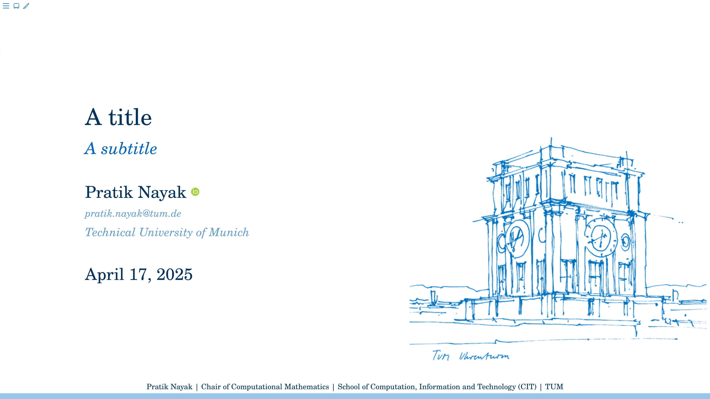
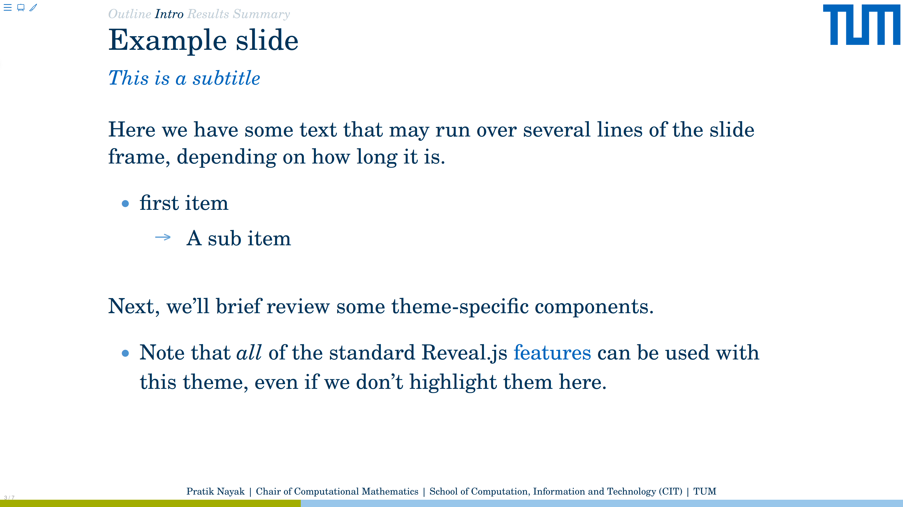

# Quarto clean inspired theme for TUM

A minimalist and elegant presentation theme for Quarto Reveal.js, inspired by
[Quarto clean](https://github.com/grantmcdermott/quarto-revealjs-clean).

An example of how the template would look like (Click on the image to go to a live demo):

[](https://pratikvn.github.io/quarto-revealjs-tum/#/title-slide)

## Use

Depending on your use case, here are some [Quarto CLI](https://quarto.org/)
commands to get started.

If you would like to add the **tum** theme to an existing directory:

```bash
quarto add pratikvn/quarto-revealjs-tum
```

If something has been updated here, you can also import the changes with the `quarto update` command:
```bash
quarto update pratikvn/quarto-revealjs-tum
```

To remove the extension, use
```bash
quarto remove pratikvn/quarto-revealjs-tum
```
Alternatively, you can use a
[Quarto template](https://quarto.org/docs/extensions/starter-templates.html)
that bundles the **tum** theme plus a .qmd starter document. This is a better
option if you are starting a new project from scratch, since it will automatically
create a new directory with all of the necessary scaffolding in one go. We provide
two template options.

- Bare bones template

```bash
quarto use template pratikvn/quarto-revealjs-tum
```

Finally, in your `.qmd` file you can use the format with

```markdown
format: tum-revealjs
```

See the [`template.qmd` file](./template.qmd) file for more details.

## Fonts

TUM recommends the [TUM Neue Helvetica font](http://portal.mytum.de/corporatedesign). If you wish, you can set the `mainfont` and `sansfont` with the fonts that you would like to use as shown in the [Quarto documentation](https://quarto.org/docs/output-formats/html-themes.html#basic-options)

## Slide overview

You can also add a slide overview using the `.sectionhead` class like so:  

``` markdown
::: {.sectionhead}
[Outline]{style="opacity:0.25"} Intro [Results Summary]{style="opacity:0.25"}
:::
```

This produces an overview above the slide heading as shown below

[](https://pratikvn.github.io/quarto-revealjs-tum/#/example-slide)
